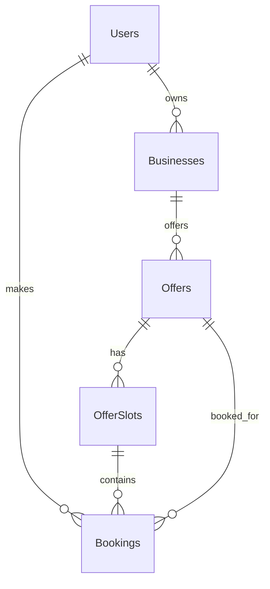

# SmartOffer AI – Dynamic Offer & Slot Marketplace Architecture

## System Architecture

The application is built using a layered enterprise architecture:
- **Presentation Layer**: React + TypeScript (Frontend), .NET 8 Web API (Backend)
- **Application Layer**: Services, DTOs, FluentValidation, BusinessRules
- **Domain Layer**: Models/Entities, Enums
- **Infrastructure Layer**: EF Core DbContext, Repositories, JWT Auth, Logging

## Database Schema & ER Diagram



### Required Entities

#### Users
- Id (Guid)
- Name (String)
- Email (String, Unique)
- PasswordHash (String)
- Role (Enum: Admin, BusinessOwner, Customer)
- CreatedAt (DateTime)

#### Businesses
- Id (Guid)
- OwnerId (Guid, FK to Users)
- Name (String)
- BusinessType (String)
- OwnerName (String)
- Phone (String)
- Email (String)
- Address (String)
- City (String)
- OpeningTime (TimeSpan)
- ClosingTime (TimeSpan)
- Logo (String)
- CreatedAt (DateTime)
- UpdatedAt (DateTime)

#### Offers
- Id (Guid)
- BusinessId (Guid, FK to Businesses)
- Title (String)
- Description (String)
- Category (String)
- OriginalPrice (Decimal)
- OfferPrice (Decimal)
- DiscountPercentage (Decimal)
- StartDate (DateOnly)
- EndDate (DateOnly)
- StartTime (TimeSpan)
- EndTime (TimeSpan)
- TotalCapacity (Int)
- MaxBookingPerCustomer (Int)
- TermsAndConditions (String)
- Status (Enum: Draft, Active, Paused, Expired, Cancelled)
- CreatedAt (DateTime)
- UpdatedAt (DateTime)

#### OfferSlots
- Id (Guid)
- OfferId (Guid, FK to Offers)
- SlotDate (DateOnly)
- StartTime (TimeSpan)
- EndTime (TimeSpan)
- Capacity (Int)
- BookedCount (Int)
- AvailableCount (Int)
- Status (Enum: Available, Full, Closed, Expired, Cancelled)
- CreatedAt (DateTime)
- UpdatedAt (DateTime)

#### Bookings
- Id (Guid)
- BookingReference (String, Unique)
- OfferId (Guid, FK to Offers)
- SlotId (Guid, FK to OfferSlots)
- CustomerId (Guid, FK to Users)
- CustomerName (String)
- CustomerPhone (String)
- CustomerEmail (String)
- PeopleCount (Int)
- SpecialNote (String)
- BookingStatus (Enum: Pending, Confirmed, Cancelled, Completed, NoShow)
- CreatedAt (DateTime)

## API Contracts

### Authentication

#### POST /api/auth/login
- **Purpose**: Authenticate user and return JWT.
- **Request Body**:
  ```json
  {
    "email": "admin@example.com",
    "password": "Password123!"
  }
  ```
- **Response Body**:
  ```json
  {
    "token": "ey...",
    "role": "Admin",
    "expiresAt": "2024-05-23T12:00:00Z"
  }
  ```
- **Validation**: Email required and valid format; Password required.
- **Errors**: 401 Unauthorized (Invalid credentials).
- **Status Codes**: 200 OK, 400 Bad Request, 401 Unauthorized.
- **Auth Required**: No.

### Business

#### POST /api/business
- **Purpose**: Create a new business profile.
- **Request Body**:
  ```json
  {
    "name": "Gym Pro",
    "businessType": "Gym",
    "ownerName": "John Doe",
    "phone": "1234567890",
    "email": "contact@gympro.com",
    "address": "123 Main St",
    "city": "NY",
    "openingTime": "06:00:00",
    "closingTime": "22:00:00",
    "logo": "logo.png"
  }
  ```
- **Response Body**: Created Business ID.
- **Validation**: Required fields, valid email/phone format, OpeningTime < ClosingTime.
- **Errors**: 400 Validation Error.
- **Status Codes**: 201 Created, 400 Bad Request, 401 Unauthorized, 403 Forbidden.
- **Auth Required**: Yes (BusinessOwner, Admin).

#### GET /api/business
- **Purpose**: List businesses.
- **Request Body**: None.
- **Response Body**: List of businesses.
- **Validation**: None.
- **Status Codes**: 200 OK.
- **Auth Required**: No.

#### PUT /api/business/{id}
- **Purpose**: Update business profile.
- **Request Body**: Similar to POST.
- **Response Body**: Updated business object or NoContent.
- **Validation**: Ensure business exists, user owns business.
- **Errors**: 404 Not Found, 403 Forbidden.
- **Status Codes**: 204 No Content, 400, 401, 403, 404.
- **Auth Required**: Yes (BusinessOwner, Admin).

### Offers

#### POST /api/offers
- **Purpose**: Create a new offer.
- **Request Body**:
  ```json
  {
    "businessId": "guid",
    "title": "50% Off Gym Pass",
    "description": "Valid for 1 month",
    "category": "Gym",
    "originalPrice": 100,
    "offerPrice": 50,
    "startDate": "2024-06-01",
    "endDate": "2024-06-30",
    "startTime": "06:00:00",
    "endTime": "12:00:00",
    "totalCapacity": 100,
    "maxBookingPerCustomer": 1,
    "termsAndConditions": "No refunds"
  }
  ```
- **Response Body**: Created Offer ID.
- **Validation**: OfferPrice < OriginalPrice, StartDate <= EndDate, TotalCapacity > 0.
- **Errors**: 400 Validation Error.
- **Status Codes**: 201 Created, 400, 401, 403.
- **Auth Required**: Yes (BusinessOwner, Admin).

#### GET /api/offers
- **Purpose**: List offers (filtered, paginated).
- **Request Body**: None (Query params for filtering: ?status=Active).
- **Response Body**: List of Offers.
- **Validation**: None.
- **Status Codes**: 200 OK.
- **Auth Required**: No.

#### GET /api/offers/{id}
- **Purpose**: Get offer details.
- **Request Body**: None.
- **Response Body**: Offer details.
- **Status Codes**: 200 OK, 404 Not Found.
- **Auth Required**: No.

#### PUT /api/offers/{id}
- **Purpose**: Update an offer.
- **Request Body**: Similar to POST.
- **Response Body**: NoContent.
- **Validation**: Ownership check, OfferPrice < OriginalPrice.
- **Status Codes**: 204 No Content, 400, 401, 403, 404.
- **Auth Required**: Yes.

#### DELETE /api/offers/{id}
- **Purpose**: Delete (or soft delete/cancel) an offer.
- **Request Body**: None.
- **Response Body**: NoContent.
- **Status Codes**: 204 No Content, 401, 403, 404.
- **Auth Required**: Yes.

### Slots

#### POST /api/slots
- **Purpose**: Create slots for an offer.
- **Request Body**:
  ```json
  {
    "offerId": "guid",
    "slotDate": "2024-06-01",
    "startTime": "08:00:00",
    "endTime": "09:00:00",
    "capacity": 10
  }
  ```
- **Response Body**: Created Slot ID.
- **Validation**: Date/Time within Offer range, Capacity > 0.
- **Status Codes**: 201 Created, 400, 401, 403.
- **Auth Required**: Yes.

#### GET /api/slots
- **Purpose**: Get slots (often filtered).
- **Status Codes**: 200 OK.
- **Auth Required**: No.

#### GET /api/offers/{offerId}/slots
- **Purpose**: Get slots specific to an offer.
- **Status Codes**: 200 OK.
- **Auth Required**: No.

#### PUT /api/slots/{id}
- **Purpose**: Update a slot (e.g., change capacity or status).
- **Status Codes**: 204 No Content, 404, 400.
- **Auth Required**: Yes.

#### DELETE /api/slots/{id}
- **Purpose**: Delete a slot (if no bookings).
- **Status Codes**: 204 No Content, 400, 404.
- **Auth Required**: Yes.

### Bookings

#### POST /api/bookings
- **Purpose**: Book a slot.
- **Request Body**:
  ```json
  {
    "offerId": "guid",
    "slotId": "guid",
    "customerName": "Alice",
    "customerPhone": "9876543210",
    "customerEmail": "alice@example.com",
    "peopleCount": 2,
    "specialNote": "Window seat"
  }
  ```
- **Response Body**: Booking reference and details.
- **Validation**: Offer active, Slot available, Capacity check, Max booking per customer check.
- **Errors**: 400 Bad Request (Slot full, Exceeded max bookings, Offer expired).
- **Status Codes**: 201 Created, 400 Bad Request, 401 Unauthorized.
- **Auth Required**: Yes (Customer).

#### GET /api/bookings
- **Purpose**: List bookings (for user or business).
- **Status Codes**: 200 OK.
- **Auth Required**: Yes.

#### GET /api/bookings/{id}
- **Purpose**: Get booking details.
- **Status Codes**: 200 OK, 404 Not Found.
- **Auth Required**: Yes.

#### PUT /api/bookings/{id}/status
- **Purpose**: Update booking status (Cancel, Confirm).
- **Request Body**:
  ```json
  { "status": "Cancelled" }
  ```
- **Status Codes**: 204 No Content, 400, 404.
- **Auth Required**: Yes.

### Dashboard

#### GET /api/dashboard/summary
- **Purpose**: Get analytics for business owner/admin.
- **Request Body**: None.
- **Response Body**:
  ```json
  {
    "totalOffers": 10,
    "activeOffers": 5,
    "totalBookings": 150,
    "todaysBookings": 20,
    "bookedSeats": 300,
    "availableSeats": 500,
    "conversionRate": 15.5,
    "revenue": 5000.00,
    "cancellationRate": 5.0
  }
  ```
- **Status Codes**: 200 OK.
- **Auth Required**: Yes (BusinessOwner, Admin).
