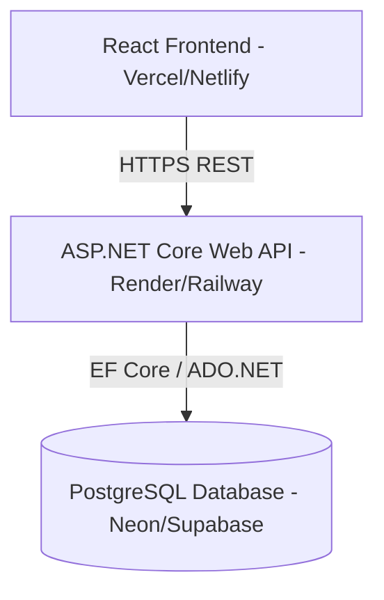

# System Architecture

## Overview
The Smart Offer system uses a Client-Server architecture:
- **Frontend**: React application built with TypeScript. Serves as the user interface for browsing offers and booking slots.
- **Backend**: .NET 8 Web API. Serves as the core business logic processor, API gateway, and handles database operations via Entity Framework Core.
- **Database**: PostgreSQL (Neon, Supabase, etc.). Stores offers, slots, bookings, and user data.

## Deployment Strategy
- **Frontend**: Vercel / Netlify for fast global edge delivery.
- **Backend**: Render / Railway / Azure App Service to host the containerized or bare-metal .NET 8 Web API.
- **Database**: Managed PostgreSQL hosting such as Neon or Supabase.

## High-Level Architecture Diagram (Mermaid)

## Security
- JWT-based Authentication is configured to ensure data access restrictions and API security.
