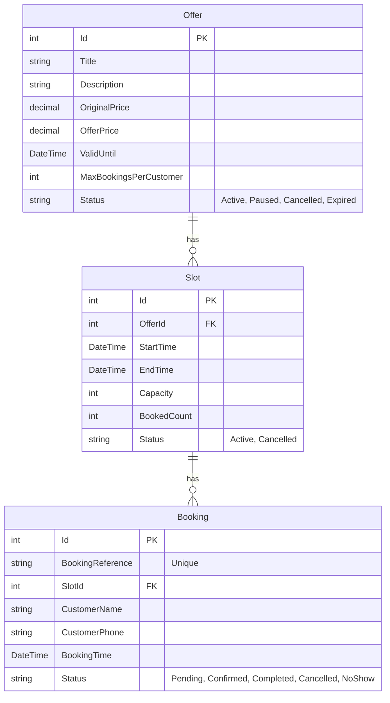

# Entity Relationship (ER) Diagram

```mermaid
erDiagram
    Offer ||--o{ Slot : "has"
    Slot ||--o{ Booking : "has"

    Offer {
        int Id PK
        string Title
        string Description
        decimal OriginalPrice
        decimal OfferPrice
        DateTime ValidUntil
        int MaxBookingsPerCustomer
        string Status "Active, Paused, Cancelled, Expired"
    }

    Slot {
        int Id PK
        int OfferId FK
        DateTime StartTime
        DateTime EndTime
        int Capacity
        int BookedCount
        string Status "Active, Cancelled"
    }

    Booking {
        int Id PK
        string BookingReference "Unique"
        int SlotId FK
        string CustomerName
        string CustomerPhone
        DateTime BookingTime
        string Status "Pending, Confirmed, Completed, Cancelled, NoShow"
    }
```
